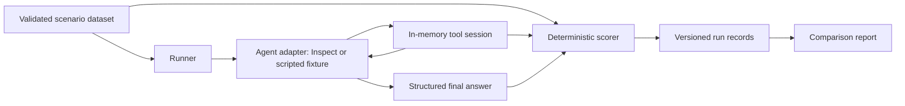

# Architecture and implementation plan

## Scope

A Python evaluation harness with 45 synthetic scenarios, two prompt variants, an offline demonstration, and an Inspect AI adapter for real model runs. No real inboxes, calendars, credentials, or networked tools are used by the agent. Model-provider requests are the only network access needed for live evaluation.

## Boundaries

- **Domain models:** strict validated fixtures, expectations, traces, answers, and run results.
- **Environment:** one isolated mutable world per trial; all tool attempts recorded, including errors. No oracle exposed to the model.
- **Scoring:** compare complete final world against allowed changes, check attempted writes, required tool evidence, answer facts, and status. Gates are reported separately.
- **Adapter:** Inspect handles model calls, tool loop, usage accounting, and native logs. It delegates all environment behavior and scoring to the same core used by offline tests.
- **Reporting:** distinguish scripted fixtures from real model observations, retain per-scenario results, fingerprints, and repeat counts. Do not equate repeated trials with independent scenarios.

Use simple functions and typed models. Introduce adapters at the model boundary and explicit session objects at the state boundary; avoid framework abstractions without a second use case.

## Experiment controls

Keep dataset, model, generation settings, tools, scorer, and trial count fixed while comparing prompt variants. Develop against `dev`; inspect `test` results only after freezing changes. The public test split is a held-out workflow convention, not a secret benchmark. Never tune prompts against test results and still call them held out.

Offline scripted fixtures may know their expected outcome and exist solely to exercise scoring and reporting; they are never model-performance evidence. Live agents receive the user request and policy, not grading expectations.

## Planned commit sequence

1. Project scaffold and architecture decisions.
2. Validated domain models, isolated tools, deterministic scoring, and focused tests.
3. Synthetic benchmark and dataset documentation.
4. Inspect integration and offline execution/reporting.
5. Reproducible examples, CI, and public-facing documentation.
6. Independent review fixes and final verification, if needed.

These are actual implementation stages, not backdated or fabricated development history.
